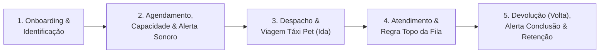
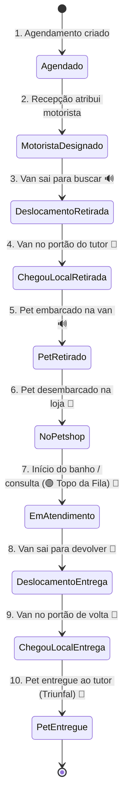

# 🗺️ Arquitetura de Processos BPMN 2.0 (Microvisão até o 3º Nível)
> **Sistema Big Dog Pet Franco da Rocha**  
> *Mapeamento Técnico-Operacional As-Is — Setembro de 2026*

---

## 📑 Sumário da Estrutura em 3 Níveis

1. **Nível 1 · Cadeia de Valor & Macroprocessos (Visão Executiva)**
2. **Nível 2 · Processos Ponta a Ponta & Interação entre Raias (Visão Operacional)**
3. **Nível 3 · Microprocessos, Regras de Código & Tabelas do Supabase (Visão Técnica)**
4. **Motor de Alertas Sonoros em Tempo Real (Web Audio API Nativa)**
5. **Motor de Crítica e Controle de Capacidade por Hora (Grade Verde/Vermelho & Encaixe)**
6. **As 5 Raias Operacionais (Atores do Sistema)**
7. **Dicionário das 10 Etapas Operacionais do Táxi Pet (`OpsStatus`)**
8. **Visualizador Interativo do BPMN 2.0**

---

## 1. Nível 1 · Macroprocessos (Cadeia de Valor)

O ecossistema Big Dog Pet opera em **5 Macroetapas Sequenciais**:

1. **Macroetapa 1 · Onboarding, Cadastro & Identificação**: Criação de contas seguras, perfis de tutores, endereços geocodificados com busca de CEP e fichas de pets com porte e peso.
2. **Macroetapa 2 · Agendamento Inteligente, Crítica de Capacidade & Alerta Sonoro**: Seleção de serviço com recálculo proporcional por porte/peso, crítica de lotação simultânea por hora (grade visual verde/vermelho), sugestão de horários livres, desvio de exceção para encaixe, cupom de aniversário de 20% e alerta sonoro cristalino de confirmação.
3. **Macroetapa 3 · Despacho, Rota do Motorista & Alertas de Viagem e Portão**: Atribuição da van, navegação em 1 toque (Waze/Google Maps), telemetria GPS em tempo real, mapa ao vivo na Home do tutor e alertas sonoros no início do deslocamento e na chegada ao portão.
4. **Macroetapa 4 · Atendimento Clínico/Estética, Alerta Sonoro & Regra de Ouro**: Ativação do status `em_atendimento` com tom sonoro de sino, promoção imediata para o topo absoluto da fila em verde esmeralda e registro de prontuário com retorno clínico.
5. **Macroetapa 5 · Devolução, Alerta Triunfal de Conclusão, Loja & Curva ABC**: Viagem de devolução (volta), alerta sonoro triunfal comemorativo na entrega do pet, e-commerce integrado com filtros inteligentes e segmentação da Curva ABC de clientes VIPs.

---

## 2. Nível 2 · Raias & Interação entre Atores

O Big Dog Pet opera com **5 Raias Especializadas**:

| Raia / Ator | Identificador | Cor no Diagrama | Papel Principal |
| :--- | :---: | :--- | :--- |
| **Tutor (Cliente)** | `C` | 🟦 Azul (`#3b82f6`) | Solicita serviços, seleciona horários na grade verde/vermelho, acompanha a van ao vivo e ouve alertas sonoros |
| **Sistema (App & Realtime)** | `S` | 🟪 Roxo (`#8b5cf6`) | Supabase Realtime, cálculo de capacidade simultânea, RLS, regras automáticas de ordenação e GPS |
| **Motorista (Táxi Pet)** | `M` | 🟨 Dourado (`#f59e0b`) | Painel `/motorista`, navegação GPS Waze/Maps, alertas de rota e avanço das 10 etapas operacionais |
| **Equipe (Admin / Recepção / Vet)** | `E` | 🟧 Laranja (`#f97316`) | Painel `/admin`, configuração de capacidade/hora, teste de alertas sonoros, despacho logístico e prontuário |
| **Comunicação & Mensageria Sonora** | `W` | 🟩 Esmeralda (`#10b981`) | Alertas sonoros sintetizados via Web Audio API, notificações toast e mensagens contextuais |

---

## 3. Nível 3 · Microprocessos & Regras de Negócio Detalhadas

### 3.1 Macroetapa 1 · Acesso, Identificação de Pet (Porte/Peso) & Endereço
* **Microregra 1.1 — Busca Automática de CEP**:
  * *Código*: `src/lib/navigation.ts` (`fetchAddressByCep`, `maskCep`).
  * *Tabela*: `addresses` (`user_id`, `street`, `number`, `district`, `city`, `state`, `cep`).
  * *Comportamento*: Ao digitar 8 dígitos do CEP, auto-preenche logradouro, bairro, cidade e UF com foco automático no número.
* **Microregra 1.2 — Porte e Peso Proporcional**:
  * *Tabela*: `pets` (`size`, `weight_kg`, `birth_date`).
  * *Comportamento*: Portes: Pequeno (<7kg), Médio (7-15kg), Grande (15-25kg), Gigante (>25kg). Ajusta o valor do serviço proporcionalmente.
* **Microregra 1.3 — Home Contextual Despoluída**:
  * *Código*: `src/routes/index.tsx` (`transportMessage`).
  * *Comportamento*: Exibe endereço personalizado do tutor: *"Buscamos e devolvemos seu pet em sua casa em [Rua], [Nº] ([Bairro])"*.

### 3.2 Macroetapa 2 · Agendamento Inteligente, Crítica de Capacidade & Alerta Sonoro
* **Microregra 2.1 — Grade Visual de Capacidade por Hora**:
  * *Código*: `src/lib/schedulingCapacity.ts` (`evaluateSlotCapacity`, `getCapacitySettings`).
  * *Configuração no Admin*: Limites parametrizáveis por hora: Banhos (padrão 3/h), Tosas (padrão 2/h) e Geral (padrão 3/h).
  * *Identidade Visual*:
    * 🟢 **Verde Esmeralda**: Horário com vagas livres (ex: `3 vagas`, `1 vaga`).
    * 🔴 **Vermelho**: Capacidade máxima atingida (ex: `Lotado`).
    * ⚫ **Cinza Riscado**: Horário já passado.
* **Microregra 2.2 — Sugestão Automática & Abertura de Exceção (Encaixe)**:
  * *Código*: `findNextAvailableSlot()` em `agendar.tsx`.
  * *Comportamento*: Se o usuário seleciona um horário esgotado (vermelho):
    1. Exibe banner de alerta explicativo com a lotação daquele horário.
    2. Sugere automaticamente o próximo horário com vaga livre com botão de troca em 1 clique (*"Mudar para 11:00"*).
    3. Oferece opção de **Abertura de Exceção**: `[ ] Abrir exceção e agendar neste horário mesmo assim (sujeito a encaixe / espera)`.
    4. Ao confirmar com a exceção marcada, o agendamento é aceito e anota automaticamente `• [ENCAIXE / EXCEÇÃO DE CAPACIDADE AUTORIZADA]` nas observações internas, impedindo a perda de faturamento!
* **Microregra 2.3 — Alerta Sonoro de Confirmação pela Loja**:
  * *Código*: `playStatusSound("confirmado")` acionado via `StatusAlertNotifier.tsx` e `admin.tsx`.
  * *Comportamento*: No instante em que o petshop confirma o agendamento, o tutor ouve um sino cristalino ascendente (D5 ➔ A5) e recebe toast comemorativo na tela principal do app!

### 3.3 Macroetapa 3 · Despacho, Rota Waze/Maps & Alertas Sonoros de Viagem
* **Microregra 3.1 — Alertas Sonoros de Transporte e Portão (Ida)**:
  * *Tom `transporte`*: Tocado quando o motorista inicia a viagem para buscar o pet (`ops_status === "em_deslocamento_retirada"`).
  * *Tom `portao`*: Aviso sonoro duplo emitido quando a van chega no endereço do tutor (`ops_status === "chegou_local_retirada"`).
* **Microregra 3.2 — Navegação em 1 Toque (Waze e Google Maps)**:
  * *Código*: `motorista.tsx` + `getWazeUrl()` / `getGoogleMapsUrl()`.
  * *Comportamento*: Disparo direto para navegação GPS com endereço completo e coordenadas.
* **Microregra 3.3 — Telemetria GPS em Tempo Real & Mapa na Home**:
  * *Tabela*: `driver_locations` + canal `driver-location:${appointmentId}`.
  * *Componente*: `DriverLiveMap.tsx` com atualização suave de posição na tela do tutor.

### 3.4 Macroetapa 4 · Atendimento & Regra de Ouro "Em Atendimento"
* **Microregra 4.1 — Alerta Sonoro de Início do Procedimento**:
  * *Tom `atendimento`*: Acorde harmônico em C5 ➔ E5 ➔ G5 tocado assim que o pet entra no banho ou consulta.
* **Microregra 4.2 — Regra de Ouro: "Em Atendimento no Topo da Fila"**:
  * *Código*: `sortInServiceFirst()` em `src/lib/format.ts`.
  * *Comportamento*: Qualquer item em atendimento sobe instantaneamente para a primeira posição de todas as filas com borda verde esmeralda pulsante.
* **Microregra 4.3 — Prontuário Médico com Agendamento Automático de Retorno**:
  * *Tabela*: `medical_records` ➔ `care_reminders`.
  * *Comportamento*: Gera lembrete de retorno sem duplicidade para fidelização preventiva.

### 3.5 Macroetapa 5 · Devolução (Volta), Alerta Triunfal de Conclusão & Curva ABC
* **Microregra 5.1 — Alerta Sonoro de Devolução e Portão (Volta)**:
  * *Tom `transporte`*: Tocado ao iniciar o trajeto de retorno para casa (`ops_status === "em_rota_devolucao"`).
  * *Tom `portao`*: Aviso sonoro duplo na chegada da van ao endereço de entrega.
* **Microregra 5.2 — Acorde Triunfal de Conclusão & Pet Entregue**:
  * *Tom `concluido`*: Acorde maior triunfal comemorativo (C5 ➔ E5 ➔ G5 ➔ C6) sintetizado no momento da entrega final (`ops_status === "pet_entregue"` ou `status === "concluido"`).
* **Microregra 5.3 — Curva ABC de Clientes VIPs**:
  * *Componente*: `CurvaAbcClientes.tsx`.
  * *Classificação*: Classe A (80% da receita), Classe B (15%) e Classe C (5% / reativação).

---

## 4. Motor de Alertas Sonoros em Tempo Real (Web Audio API Nativa)

O sistema conta com um sintetizador sonoro exclusivo implementado em `src/lib/soundAlerts.ts` utilizando a **Web Audio API nativa** do navegador:

| Tom Sonoro | Frequências Sintetizadas | Ocasião de Disparo | Experiência do Usuário |
| :--- | :--- | :--- | :--- |
| **`confirmado`** | D5 (587 Hz) ➔ A5 (880 Hz) + harmônico | Agendamento confirmado pela recepção da loja | Sino de confirmação cristalino de sucesso |
| **`transporte`** | A4 (440 Hz) ➔ E5 (659 Hz) ➔ A5 (880 Hz) | Motorista inicia viagem (ida para buscar ou volta para entregar) | Melodia dinâmica de movimentação e viagem |
| **`portao`** | G5 (784 Hz) duplo espaçado | Van chega no portão / endereço do cliente | Toque amigável de interfone / portão |
| **`atendimento`**| C5 (523 Hz) ➔ E5 (659 Hz) ➔ G5 (784 Hz) | Pet entra em atendimento / banho / tosa | Acorde acolhedor de início do procedimento |
| **`concluido`**  | C5 (523 Hz) ➔ E5 ➔ G5 ➔ C6 (1046 Hz) | Pet entregue e atendimento finalizado com sucesso | Fanfarra triunfal comemorativa |
| **`alerta`**     | E5 (659 Hz) ➔ A5 (880 Hz) | Motorista designado ou cancelamento | Tom de atenção suave |

> **Vantagens Arquiteturais:**  
> 1. **Zero dependência de rede:** Não consome banda, não requer arquivos `.mp3`/`.wav` e nunca falha por erro 404 ou CORS.  
> 2. **Latência de 0ms:** O áudio é sintetizado em tempo real pelos osciladores do processador.  
> 3. **Conformidade com Autoplay:** Auto-desbloqueio transparente (`unlockAudioOnFirstGesture`) no primeiro toque do usuário.  
> 4. **Controle de Usuário:** Botão de silenciar/ativar som com ícone de volume integrado no cabeçalho do `AppShell` e persistido em `localStorage`.

---

## 5. Dicionário das 10 Etapas Operacionais do Táxi Pet (`OpsStatus`)

---

## 6. Visualizador Interativo Disponível

O diagrama BPMN 2.0 vertical interativo completo com zoom dinâmico e exportação em alta resolução está atualizado e disponível em:  
👉 [**Abrir Diagrama BPMN Interativo do Big Dog Pet**](file:///C:/Users/Henrique/.gemini/antigravity/brain/d6c4f97a-324d-4f20-b013-9c5c974d9ef5/bpmn_processo_atualizado_big_dog_pet.html)
