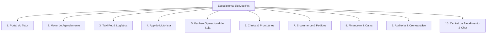
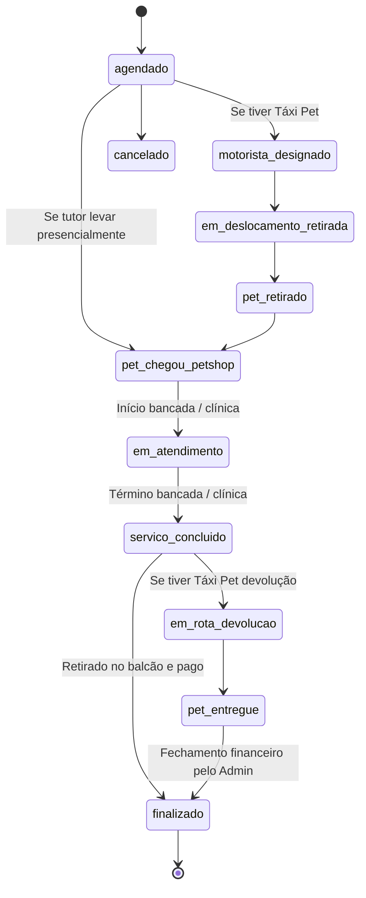

# PRD — Product Requirements Document: Big Dog Pet (Franco da Rocha)
**Versão**: 2.0  
**Data**: 11 de Setembro de 2026  
**Status**: Aprovado para Engenharia & Operações  
**Autor**: Pair Programming Assistant & Equipe de Produto Big Dog Pet  

---

## 1. Visão Geral e Proposta de Valor

O **Big Dog Pet** é um ecossistema digital integrado (Web/Mobile) projetado para gerenciar todas as pontas operacionais, clínicas, logísticas e comerciais de um pet shop e centro clínico veterinário moderno sediado em Franco da Rocha e região.

### 1.1 Objetivo do Produto
- **Centralização Operacional**: Eliminar controles manuais em papel e planilhas dispersas, unificando agendamento, atendimento em bancada, procedimentos cirúrgicos, transporte leva-e-traz e loja virtual em uma única plataforma.
- **Transparência e Confiança para o Tutor**: Fornecer rastreamento em tempo real (GPS do Táxi Pet, status do pet em 1ª pessoa, prontuário clínico e alertas preventivos de saúde).
- **Excelência em Gestão por Cronoanálise**: Mensurar tempos e movimentos de cada etapa do processo (logística do Táxi Pet, tempo de fila, tempo de bancada vs. tabela técnica e SLA de suporte no chat).
- **Eficiência Financeira e Controle de Caixa**: Controle de formas de pagamento no encerramento pelo administrador, análise da Curva ABC (clientes, produtos e serviços) e redução de rupturas de estoque.

---

## 2. Personas e Atores do Sistema

| Ator | Descrição e Contexto de Uso | Canais de Acesso |
| :--- | :--- | :--- |
| **Tutor (Cliente Final)** | Proprietário de cães ou gatos. Busca agendar serviços, comprar produtos, acompanhar o deslocamento do Táxi Pet e receber alertas de saúde do pet. | Portal Web Responsivo / PWA Mobile |
| **Motorista (Táxi Pet)** | Operador de campo responsável pelo transporte seguro dos pets (coleta e devolução). | App do Motorista (Mobile First) com GPS |
| **Equipe Operacional (Banhista / Tosador / Auxiliar)** | Executa os serviços físicos no pet shop, registra início/fim de bancada e observa particularidades do animal. | Painel Kanban de Bancada / Balcão |
| **Veterinário / Equipe Clínica** | Realiza consultas, prescrições, vacinações e cirurgias veterinárias. Alimenta o prontuário eletrônico. | Módulo Clínico / Prontuário Web |
| **Administrador / Gerente** | Controla a agenda, aprova agendamentos, finaliza atendimentos com recebimento financeiro, gerencia estoque e audita relatórios e cronoanálises. | Painel Administrativo Completo |

---

## 3. Arquitetura de Módulos e Funcionalidades

### 3.1 Portal do Tutor
1. **Gestão de Perfil e Endereços**:
   - Cadastro com nome completo, telefone (WhatsApp), e-mail e múltiplos endereços com validação de CEP e bairro.
2. **Cadastro e Prontuário Visual do Pet**:
   - Ficha com foto (upload direto com crop/redimensionamento), nome, espécie (Cão/Gato), raça, porte (Pequeno, Médio, Grande, Gigante), data de nascimento, peso, histórico de alergias e particularidades de temperamento.
3. **Acompanhamento em Tempo Real**:
   - Linha do tempo interativa com mensagens humanizadas narradas na perspectiva do pet.
   - Mapa ao vivo (Leaflet) rastreando a localização do motorista quando o serviço inclui transporte.
4. **Histórico Completo**:
   - Acesso a atendimentos anteriores, vacinas aplicadas, datas de retorno e pedidos da loja.

### 3.2 Motor de Agendamento & Serviços Inteligentes
1. **Seleção de Pet & Categoria de Serviço**:
   - Filtros inteligentes por categoria: Banho, Tosa, Higiênica, Hidratação, Veterinário Clínico e Cirurgias.
2. **Matriz de Duração e Precificação**:
   - Tempos de duração padronizados em lista suspensa: 30 min, 45 min, 60 min, 90 min, 120 min ou mais.
   - Preços baseados na categoria e no porte do animal cadastrado.
3. **Catálogo de Procedimentos Veterinários e Cirurgias**:
   - Procedimentos clínicos padrão: Consulta Geral, Consulta Retorno e Imunização / Aplicação de Vacinas.
   - Tabela oficial das 5 cirurgias veterinárias mais recorrentes em pet shops (Castração Macho, Castração Fêmea, Profilaxia Dentária / Tartarectomia, Nodulectomia e Cirurgia Oftálmica / Cherry Eye).
4. **Seleção de Modalidade de Transporte (Táxi Pet)**:
   - Opções: "Sem transporte (levar à loja)", "Buscar e Devolver (Leva e Traz)", "Apenas Buscar (Só Ida)" e "Apenas Devolver (Só Volta)".
   - Cálculo automático e soma transparente da taxa de transporte ao valor final do agendamento.
5. **Grade de Horários Disponíveis**:
   - Bloqueio inteligente de horários esgotados de acordo com a capacidade operacional do dia.

### 3.3 Logística & Módulo de Táxi Pet
1. **Gestão de Zonas de Atendimento & Bairros**:
   - Parametrização de bairros atendidos em Franco da Rocha e regiões limítrofes, com definição de taxas e tempos médios estimados de deslocamento.
2. **Simulador de Frete e Entregas**:
   - Ferramenta para cotação rápida de corridas e pedidos com base no endereço do cliente.
3. **Despacho e Atribuição de Motorista**:
   - Vinculação de corridas a motoristas cadastrados ou fila de espera para aceite.
4. **Histórico de Rotas e Cronometragens**:
   - Registro individual dos carimbos de data/hora (timestamps) de cada uma das 5 etapas da corrida.

### 3.4 Módulo do Motorista (App de Campo)
1. **Painel de Corridas do Dia**:
   - Visualização das rotas organizadas por prioridade e horário agendado.
2. **Navegação e Contato**:
   - Acesso com 1 clique ao endereço no Google Maps / Waze e botão de contato direto via WhatsApp/Telefone com o tutor.
3. **Avanço Sequencial de Status**:
   - Botões intuitivos para registrar o avanço do transporte (A caminho da retirada -> Pet recolhido -> Pet entregue no petshop -> Em rota de devolução -> Pet entregue ao tutor).
4. **Transmissão de Localização GPS**:
   - Envio periódico de coordenadas geográficas para alimentar o mapa ao vivo visualizado pelo cliente e pelo administrador.

### 3.5 Kanban Operacional & Sala de Banho/Atendimento
1. **Quadro Kanban de Atendimento**:
   - Colunas visuais: *Aguardando Início*, *Em Atendimento (Bancada/Clínica)* e *Concluído*.
2. **Identificação Rápida**:
   - Cards com foto do pet, nome do tutor, serviço, porte, observações e cronômetro de tempo decorrido.
3. **Ações Rápidas de Balcão**:
   - Transferência de estado com 1 clique, registro de intercorrências e acionamento de comunicação com o tutor.

### 3.6 Módulo de Gestão Clínica Veterinária & Prontuários
1. **Prontuário Médico Eletrônico**:
   - Registro de anamnese, exame físico, peso, temperatura, frequência cardíaca, suspeita diagnóstica e prescrição medicamentosa.
2. **Controle de Imunização e Vacinas**:
   - Histórico de vacinas aplicadas (V8/V10, Antirrábica, Gripe Canina, Giardia, etc.), lote, data de aplicação e data exata de revacinação anual.
3. **Alertas Preventivos de Saúde**:
   - Painel centralizador com contadores e badges de pets com vacinas vencidas ou com retorno próximo (7, 15 ou 30 dias), permitindo disparo ativo de lembretes pelo WhatsApp.

### 3.7 E-commerce & Loja Integrada
1. **Catálogo de Produtos**:
   - Fotos, descrições, marcas, categorias e controle de estoque.
2. **Carrinho e Checkout**:
   - Opções de entrega via Táxi Pet ou retirada balcão.
3. **Gestão de Pedidos**:
   - Fluxo de separação, faturamento e entrega com notificação ao cliente.

### 3.8 Financeiro, Caixa e Finalização do Atendimento
1. **Tela de Finalização pelo Administrador**:
   - A finalização do serviço e o fechamento financeiro são atribuições exclusivas do Administrador / Recepcionista.
2. **Registro da Forma de Pagamento**:
   - Seleção explícita entre: **Cartão de Crédito**, **Cartão de Débito**, **PIX** ou **Dinheiro**.
3. **Demonstrativo Consolidado**:
   - Discriminação do valor do serviço principal, taxa de transporte (Táxi Pet), produtos extras consumidos e total geral pago.
4. **Controle de Caixa Diário**:
   - Faturamento total do dia discriminado por categoria de serviço e por meio de pagamento.

### 3.9 Auditoria Gerencial, Cronoanálise de Processos & BI
1. **Cronoanálise do Táxi Pet (Transporte & Corridas)**:
   - **5 Etapas Cronometradas**:
     1. *Recebimento da corrida*: tempo desde a criação do agendamento até a confirmação/atribuição do motorista.
     2. *Chegada ao cliente*: tempo de deslocamento do pet shop até a residência do tutor.
     3. *Volta ao pet shop*: tempo de recolhimento do pet e retorno até a loja.
     4. *Retorno ao cliente*: tempo de transporte da loja de volta até o lar do pet.
     5. *Tempo Geral do Pet*: tempo total em que o animal esteve em trânsito com o motorista.
   - **Visão 1 — Detalhada por Corrida**: Lista individual ordenada do maior tempo para o menor tempo.
   - **Visão 2 — Consolidada por Cliente**: Análise agrupada por tutor, exibindo média de tempo de corrida, bairros atendidos e total de viagens.
2. **Cronoanálise de Atendimento no Pet Shop (Loja)**:
   - *Tempo de Espera no Pet Shop (Fila)*: Intervalo entre a chegada do pet na loja e o início efetivo do serviço na bancada.
   - *Duração Real em Bancada vs. Tempo Previsto*: Comparação do tempo real gasto com o tempo padrão do serviço.
   - *Pontualidade de Bancada*: Indicador de desvio em minutos com classificação visual (Adiantado, Pontual, Atrasado).
3. **Cronoanálise de Suporte no Chat**:
   - Medição do tempo de espera até a 1ª resposta humana do atendente.
   - Tempo total de fechamento do chamado.
   - Avaliação de agilidade (Rápido ≤ 5 min, Moderado ≤ 15 min, Lento > 15 min).
4. **Análise de Curva ABC (Princípio de Pareto 80/20)**:
   - **Curva ABC de Clientes**: Identificação dos clientes Classe A que representam o maior volume de receita do negócio.
   - **Curva ABC de Serviços**: Ranking dos serviços de maior rentabilidade e giro.
   - **Curva ABC de Produtos**: Monitoramento de vendas com alertas críticos de reposição de estoque para itens Classe A.
5. **Relatórios e Exportações**:
   - Filtros por período (Hoje, 7 dias, 30 dias, Mês Atual, Personalizado).
   - Exportação direta para PDF e Excel (.xlsx).

### 3.10 Central de Comunicação & Chat Multicanal
1. **In-App Chat**:
   - Canal direto entre o tutor e a recepção com identificação do pet e contexto do atendimento.
2. **Notificações Automáticas de WhatsApp**:
   - Disparos automáticos nas etapas críticas: saída para coleta, chegada na loja, término do banho/tosa e saída para entrega.

---

## 4. Regras de Negócio e Políticas Operacionais (Business Rules)

### 4.1 Regras de Agendamento e Capacidade (RN-AGE)
- **RN-AGE-01 (Antecedência Mínima)**: Agendamentos devem ser realizados com no mínimo 2 horas de antecedência em relação ao horário solicitado, salvo autorização manual do administrador.
- **RN-AGE-02 (Validação de Porte e Duração)**:
  - Cães de porte Grande e Gigante exigem um acréscimo automático de tempo de bancada (mínimo de +30 minutos em relação ao porte pequeno) para evitar sobrecarga nas banheiras.
- **RN-AGE-03 (Horários de Funcionamento)**:
  - A grade só permite marcações dentro dos horários comerciais ativos cadastrados (segunda a sábado, 08h00 às 18h00).
- **RN-AGE-04 (Exclusividade de Veterinário)**:
  - Procedimentos veterinários e cirurgias não podem ser alocados em horários simultâneos para o mesmo médico veterinário responsável.

### 4.2 Regras do Táxi Pet e Logística (RN-LOG)
- **RN-LOG-01 (Obrigatoriedade de Endereço Completo)**: Não é permitido selecionar qualquer modalidade de Táxi Pet sem que o tutor tenha um endereço cadastrado com CEP, logradouro, número e bairro válidos.
- **RN-LOG-02 (Cálculo da Taxa de Transporte)**:
  - O valor da taxa de transporte é determinado pela zona geográfica do bairro.
  - Na modalidade "Buscar e Devolver", a tarifa integral da rota dupla é cobrada.
  - Nas modalidades "Apenas Buscar" ou "Apenas Devolver", aplica-se a regra de meia-rota configurada no sistema.
- **RN-LOG-03 (Soma Obrigatória no Checkout)**: Ao agendar qualquer serviço (seja banho, tosa ou veterinário) com transporte selecionado, o sistema soma compulsoriamente o `transport_price_cents` ao `service_price_cents`, compondo o `total_cents`.
- **RN-LOG-04 (Lotação Segura do Veículo)**: O número de pets transportados no mesmo trajeto não pode exceder o limite de caixas de transporte homologadas do veículo do motorista.

### 4.3 Máquina de Estados Operacional (RN-OPS)
O ciclo de vida de todo atendimento obedece à máquina de estados estrita abaixo:

- **RN-OPS-01 (Transição Ordenada)**: Nenhum serviço pode ser marcado como "Concluído" sem ter passado pelo estado "Em Atendimento", garantindo a integridade dos cálculos de cronoanálise de bancada.
- **RN-OPS-02 (Gravação de Histórico)**: Toda e qualquer alteração de estado registra automaticamente um registro imutável em `pet_status_history` contendo: id do agendamento, status anterior, novo status, timestamp com precisão de segundos e usuário responsável pela alteração.

### 4.4 Regras Financeiras e Cobrança (RN-FIN)
- **RN-FIN-01 (Papel do Administrador na Finalização)**:
  - O motorista não realiza o encerramento contábil nem a baixa de pagamentos em seu aplicativo de campo.
  - A responsabilidade de registrar o recebimento é exclusiva do **Administrador / Caixa** na tela de gestão operacional.
- **RN-FIN-02 (Obrigatoriedade da Forma de Pagamento)**:
  - Nenhum atendimento pode transicionar para o estado `finalizado` sem que a forma de pagamento (`payment_method`) tenha sido explicitamente informada:
    - `credito` (Cartão de Crédito)
    - `debito` (Cartão de Débito)
    - `pix` (Pagamento Instantâneo PIX)
    - `dinheiro` (Espécie)
- **RN-FIN-03 (Status de Pagamento)**:
  - Ao registrar o meio de pagamento e confirmar a finalização, o sistema atualiza `payment_status` de `pendente` para `pago` e grava `paid_at = now()`.

### 4.5 Regras Clínicas e Cirúrgicas (RN-CLI)
- **RN-CLI-01 (Previsão de Jejum para Cirurgias)**: Procedimentos cirúrgicos (como castrações e tartarectomias) exigem a apresentação obrigatória de orientação de jejum hídrico e alimentar de 8 a 12 horas ao tutor durante o agendamento.
- **RN-CLI-02 (Registro de CRMV Obrigatório)**: Prescrições e relatórios cirúrgicos devem conter o nome do médico veterinário e o número do registro profissional no CRMV.
- **RN-CLI-03 (Cálculo de Retorno Preventivo de Vacina)**:
  - Ao aplicar uma vacina com intervalo anual, o sistema agenda automaticamente o alerta de revacinação para 335 dias após a aplicação (30 dias antes do vencimento anual de 365 dias).

### 4.6 Regras de Cronoanálise de Processos (RN-CRONO)
- **RN-CRONO-01 (Cálculo de Espera na Fila)**:
  $$\text{Tempo de Espera (min)} = \frac{\text{Timestamp de Início do Atendimento} - \text{Timestamp de Chegada ao Pet Shop}}{60}$$
- **RN-CRONO-02 (Cálculo de Desvio de Bancada)**:
  $$\text{Desvio (min)} = \text{Duração Real Executada} - \text{Duração Prevista de Tabela}$$
  - $\text{Desvio} \le -5 \text{ min}$: Classificado como **Adiantado** (Verde).
  - $-5 < \text{Desvio} \le +10 \text{ min}$: Classificado como **Pontual** (Azul/Verde).
  - $\text{Desvio} > +10 \text{ min}$: Classificado como **Atrasado** (Âmbar/Vermelho).
- **RN-CRONO-03 (Ordenação Padrão dos Relatórios)**:
  - O painel de Cronoanálise do Táxi Pet e do Suporte no Chat deve ordenar os dados por padrão **do maior tempo para o menor tempo**, permitindo atuação imediata da gerência sobre os gargalos operacionais e clientes com maior espera.
- **RN-CRONO-04 (Layout sem Rolagem Lateral)**:
  - Todas as tabelas gerenciais de cronoanálise devem exibir cabeçalhos em linha dupla (Título e Contexto) e densidade compacta de linhas e badges, garantindo visualização integral de todas as colunas sem corte horizontal.

### 4.7 Regras da Curva ABC e Estoque (RN-ABC)
- **RN-ABC-01 (Classificação Percentual de Faturamento)**:
  - **Classe A**: Primeiros itens/clientes que compõem até 80% do faturamento acumulado.
  - **Classe B**: Itens/clientes subsequentes que compõem os próximos 15% (80% a 95%).
  - **Classe C**: Itens/clientes que compõem os últimos 5% (95% a 100%).
- **RN-ABC-02 (Alerta Crítico de Ruptura)**: Qualquer produto classificado como Classe A cujo estoque físico atinja ou fique abaixo do ponto de reposição dispara um alerta visual imediato no topo do painel administrativo.

---

## 5. Requisitos Não Funcionais (NFRs)

| Dimensão | Requisito | Critério de Aceite |
| :--- | :--- | :--- |
| **Performance** | Tempo de Carregamento & TTI | Páginas críticas devem carregar com FCP < 1.5s e TTI < 2.5s em conexões 4G móveis. |
| **Responsividade** | Mobile-First nas Telas de Campo | As telas do Tutor e do Motorista devem ser 100% operáveis com uma mão em smartphones (touch targets ≥ 44px). |
| **Integridade de Git & Lovable** | Políticas de Versionamento | **Proibido reescrever histórico (force push / rebase)** no repositório vinculado ao Lovable para evitar quebras de sincronização. |
| **Disponibilidade & Borda** | Infraestrutura Serverless | Aplicação construída com Vite + SSR + Nitro Worker para implantação em Cloudflare Edge com latência sub-100ms. |
| **Privacidade & LGPD** | Proteção de Dados Pessoais | Telefones e endereços dos tutores só ficam visíveis para motoristas designados durante o período ativo da corrida. |
| **Acessibilidade (a11y)** | WCAG 2.1 AA | Contraste de cores adequado, foco acessível e navegação por teclado nos formulários administrativos. |

---

## 6. Métricas de Sucesso e KPIs do Negócio

1. **Eficiência de Transporte**: Redução de 20% no Tempo Geral do Pet em trânsito no Táxi Pet.
2. **Pontualidade de Bancada**: Manter pelo menos 85% dos atendimentos dentro da margem de pontualidade da tabela técnica.
3. **SLA do Chat de Suporte**: 90% dos chamados respondidos pelo atendente em menos de 5 minutos.
4. **Taxa de Retorno de Vacinas**: Atingir 70% de adesão nos retornos clínicos e imunizações preventivas a partir dos alertas automáticos.
5. **Acurácia Financeira**: 100% dos atendimentos fechados com identificação da forma de pagamento e reconciliação diária de caixa.
